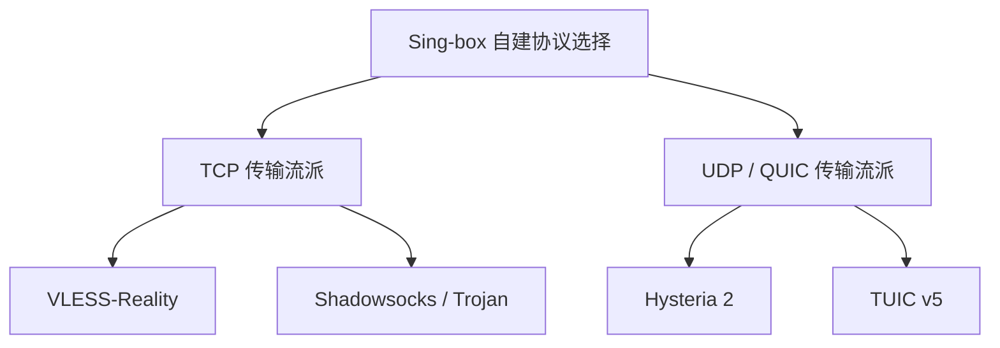
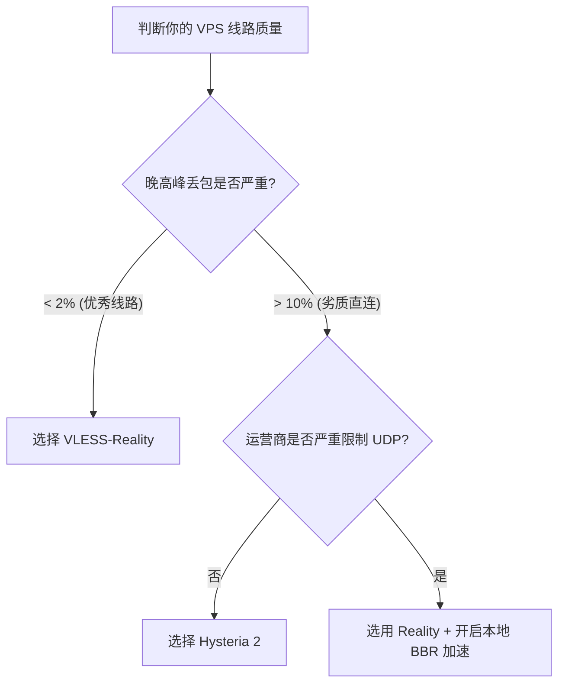

对于每一个喜欢折腾 VPS 的自建党来说，**Sing-box** 最迷人的地方莫过于它对各种底层网络传输协议极其庞大且原生的支持。

但这也带来了一个幸福的烦恼：**Shadowsocks、VLESS-Reality、TUIC v5、Hysteria 2……我们到底该选哪一个？**

经常有朋友在后台留言：“我的 VPS 是美区普通直连，为什么用 Reality 高峰期卡成幻灯片，换成 Hysteria 2 却能秒开 4K？”或者“我的节点延迟很低，为什么玩游戏总是频繁断线？”

其实，这并不是因为某个协议有绝对的“碾压级”优势，而是因为它们的**底层传输基因（TCP 与 UDP）**不同，所适合的“战场环境”（网络线路）也截然不同。今天我们就来彻底对比一下三大主流协议，帮你根据手头的 VPS 线路，配置出最强的 Sing-box 出站。

## Table of contents

## 一、协议族谱与底层基因对比

在 Sing-box 架构下，目前最主流的自建协议主要分为两个大门派：**TCP 阵营** 与 **UDP (QUIC) 阵营**。

### 1. TCP 阵营的王牌：VLESS-Reality
VLESS 协议本身极度轻量，而 **Reality** 则是它的终极保护壳。
*   **核心原理**：Reality 抛弃了传统的自签证书方案，而是通过“借用”别人的证书（比如微软、雅虎或苹果官方域名）来完成 TLS 握手。在监管方看来，你只是在访问一个完全合法的境外大厂网页。
*   **传输层**：基于传统 **TCP 协议**。数据包必须严格按照顺序到达，一旦发生丢包，整个通道都会停下来等待重传。

### 2. UDP 阵营的悍将：TUIC 与 Hysteria 2
这两个协议都是基于 **HTTP/3 (QUIC)** 协议构建的，底层全部跑在 **UDP** 之上。
*   **TUIC v5**：旨在为代理场景提供最轻量、低延迟的 QUIC 实现。它将协议层降到最简，旨在减少握手往返时间（RTT）。
*   **Hysteria 2**：由 Hysteria 1 协议完全重构而来，最大的杀手锏是内置了**主动拥塞控制算法（BBR 变种）**与**主动丢包补偿**。它就像是一辆加足了马力的装甲越野车，不管路面（丢包率）有多烂，都要强行把数据以设定好的速度送过去。

---

## 二、全方位性能指标大考

为了更直观地看清它们的差异，我们整理了一份多维度的性能对比表：

| 维度 | VLESS-Reality | TUIC v5 | Hysteria 2 |
| :--- | :--- | :--- | :--- |
| **底层协议** | TCP + TLS (借用证书) | UDP + QUIC | UDP + BBR (魔改版) |
| **抗封锁能力** | 🏆 **极高** (拟真度完美) | 中等 (易被运营商限速/QoS) | 中等 (特征相对明显) |
| **抗丢包能力** | 较差 (受制于 TCP 滑动窗口) | 优秀 (QUIC 多路复用) | 🏆 **极强** (暴力重传控制) |
| **建连延迟** | 正常 (TCP 3次+TLS 2次) | 🏆 **极低** (QUIC 0-RTT/1-RTT) | 🏆 **极低** (QUIC 0-RTT) |
| **设备 CPU 开销** | 🏆 **极低** (无额外算法) | 正常 | 偏高 (大流量暴力发包计算) |
| **适合线路** | 高端优化线路 (GIA/9929/CUID) | 优质中转/常规直连线路 | 🏆 **劣质/丢包严重的长距离线路** |

---

## 三、三大协议的核心优缺点分析

### VLESS-Reality：大隐隐于市的伪装大师
*   **优点**：**极难被主动探测封锁**。因为它的 TLS 握手特征与目标“借用”网站完全一致。由于跑在 TCP 上，对各大运营商的防火墙（GFW）来说，这就是最标准的 HTTPS 流量。
*   **缺点**：在**高丢包率**（如晚高峰跨国直连）环境下，TCP 的拥塞控制会导致传输速度断崖式下跌。哪怕你的带宽是千兆，一旦丢包率达到 10%，速度可能会缩水 90%。
*   **关联阅读**：如果你准备在你的优质节点上配置它，可以参考我们的详细教程：[《手把手教你配置 VPS 原生 VLESS-Reality 节点》](/posts/vps-singbox-vless-reality/)。

### Hysteria 2：弱网与劣质线路的暴力救星
*   **优点**：**天下武功，唯快不破**。Hysteria 2 采用主动带宽探测，完全无视常规 TCP 慢启动规则。在 30% 丢包的极端恶劣网络下，它依然能强行跑满你的宽带，是在晚高峰流畅播放 4K 视频的终极底牌。
*   **缺点**：由于其发包极其霸道且跑在 UDP 上，容易招致部分地区运营商的**“重点关照”**，直接对你的端口进行 UDP 限速或短暂阻断（俗称 UDP QoS）。
*   **关联阅读**：关于如何优化 Hysteria 2 的端口跳跃和降温配置，可移步阅读：[《自建 Hysteria 2 与 TUIC 协议高级防阻断优化指南》](/posts/sing-box-tuic-hysteria2-guide/)。

### TUIC v5：追求极致建连延迟的极简主义者
*   **优点**：**0-RTT 建连**。它完美继承了 QUIC 的多路复用优势，网页并发加载和 APP 内零散 API 请求的响应速度在体感上快到极致。同时，它的 CPU 占用比 Hysteria 2 要温和得多，非常适合部署在手机常驻后台。
*   **缺点**：缺乏 Hysteria 2 那种狂暴的主动发包控速算法，在面对极其恶劣的丢包线路时，速度上限不如 Hysteria 2。

---

## 四、自建党决策指南：你该怎么选？

为了方便大家对号入座，我们将推荐方案整理为三大典型场景：

### 场景 A：你的 VPS 线路十分优秀（如 CN2 GIA、联通 9929、AS4837 优化线）
*   **🥇 推荐首选**：**VLESS-Reality**
*   **理由**：线路质量本身极佳，丢包极少，根本不需要 UDP 的暴力重传。此时使用伪装度最高、最安全的 Reality 是终极解，既能保证极度安全，又能跑满宽带。

### 场景 B：你的 VPS 属于普通直连（如搬瓦工普通线路、甲骨文免费机、各类廉价美西/欧洲机房）
*   **🥇 推荐首选**：**Hysteria 2**
*   **理由**：这些机器在晚高峰的丢包率常常直奔 15% 以上。此时 TCP 协议早已瘫痪，唯有依靠 Hysteria 2 暴力重传才能拯救你的油管/Netflix 4K 画质。如果遇到运营商对 UDP 的严重限制，也可以尝试配置 **TUIC v5** 作为备用。

### 场景 C：你的运营商对 UDP 流量有极度严格的 QoS 限制（常见于部分北方移动/联通）
*   **🥇 推荐首选**：**VLESS-Reality + 开启 VPS 端的 BBRv3 / BBR-plus 算法**
*   **理由**：一旦遇到只要检测到 UDP 大流量就直接拔线或降速到 128Kbps 的运营商，Hysteria 2 和 TUIC 将彻底哑火。此时必须回归 TCP 路线，并配合 VPS 底层的 BBR 加速来平滑丢包影响。
*   **补充调优**：关于如何在你的 Linux VPS 底层开启并调试 BBR 拥塞算法，请查阅我们的历史教程：[《Linux BBR 拥塞控制算法开启与网络吞吐调优指南》](/posts/linux-bbr-accelration-guide/)。

---

## 结语

网络技术没有银弹，Sing-box 为我们提供了丰富的弹药库，我们需要做的是根据自己所处的网络环境因地制宜。

最完美的客户端配置，往往不是单押某一个协议，而是在 `outbounds` 中同时写入 **VLESS-Reality（主打安全与直连）** 和 **Hysteria 2（主打弱网突围与备用）**，再配合 Sing-box 强大的 `urltest` 自动测速分流。只有这样，才能在复杂的公网波澜中，做到全天候无感冲浪。
