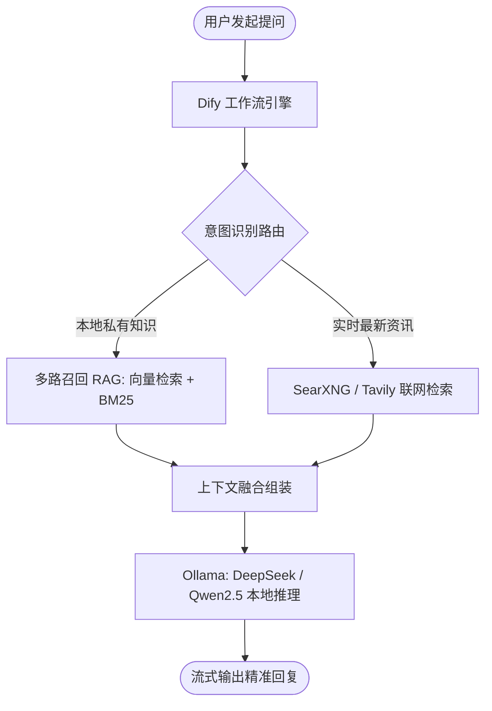

纯本地运行的 Ollama 模型（如 DeepSeek-R1 / Qwen2.5）虽具备 100% 数据隐私安全，但受限于训练截断期，无法回答最新技术与动态；而传统的纯代码 LangChain 方案维护门槛高、调试极其困难。

**Dify** 作为 2026 年最主流的开源大模型应用开发与工作流编排平台，将**本地私有模型推理**、**混合多路召回 RAG (向量 + BM25 全文检索)** 与 **实时搜索引擎工具调用 (Tool Calling)** 深度融合！

> [!NOTE]
> **📌 核心速览（TL;DR / 快问快答）：**
>
> - **全栈私有闭环**：Dify (工作流编排) + Ollama (本地大模型/Embedding) + Qdrant/Milvus (向量库) + SearXNG (无隐私追踪联网搜索)。
> - **混合召回 + 重排 (Rerank)**：结合向量语义相似度与 BM25 关键词检索，配合 BGE-Reranker 达到工业级 95%+ 问答命中率。
> - **容器网络打通**：在 Dify 中连接本地 Ollama 时，基础 URL 填写 `http://host.docker.internal:11434`（需确保 Ollama 监听 `0.0.0.0:11434`）。

---

## 🛠️ 2026 私有化 AI 架构实战



---

## 🚀 Dify 与 Ollama 组网关键配置

### 1. 配置 Ollama 允许外部容器访问

在运行 Ollama 的宿主机上配置环境变量：

```bash
# Linux Systemd 配置 /etc/systemd/system/ollama.service.d/override.conf
[Service]
Environment="OLLAMA_HOST=0.0.0.0:11434"
Environment="OLLAMA_ORIGINS=*"
```

重启服务：`systemctl daemon-reload && systemctl restart ollama`。

### 2. 在 Dify 中添加 Ollama 模型

1. 登录 Dify 后台 -> **设置 -> 模型供应商 -> Ollama**。
2. 添加 **LLM 模型**：
   - 模型名称：`qwen2.5:14b` 或 `deepseek-r1:14b`
   - 基础 URL：`http://host.docker.internal:11434`
3. 添加 **Embedding 向量模型**：
   - 模型名称：`bge-m3:latest` 或 `nomic-embed-text`
   - 基础 URL：`http://host.docker.internal:11434`

---

## ❓ 常见问题与 AI 快问快答 (FAQ)

### Q1: Dify 连接 Ollama 提示 `Connection Refused` 怎么办？

**答**：如果在 Linux Docker 环境中，`host.docker.internal` 可能未默认解析；可在 Dify 的 `docker-compose.yml` 中为 API 容器添加 `extra_hosts: - "host.docker.internal:host-gateway"`。

### Q2: 部署 Dify 云端后端需要哪种规格的独立服务器？

**答**：若本地 GPU 运行 Ollama，云端仅运行 Dify 服务端只需 2核 4GB 内存；在 **DMIT** 或 **搬瓦工** 的 **中国电信 CN2 GIA** 或 **联通 AS9929** 专线 VPS 上部署 Dify，能实现海外 API 毫秒级流式打字效果。选购参考见 [《2026 国外 VPS 选购指南》](/posts/vps-buying-guide-2026/)。

---

_（相关资源导航：如果您需要购买部署 AI 工作流平台的独立 VPS，欢迎阅读 [《2026 国外 VPS 选购指南》](/posts/vps-buying-guide-2026/) 获取 DMIT、搬瓦工与 CloudCone 优惠；商用专线推荐见 [《“饿饭CC云”深度评测》](/posts/efan-cc-cloud-review/)！）_
