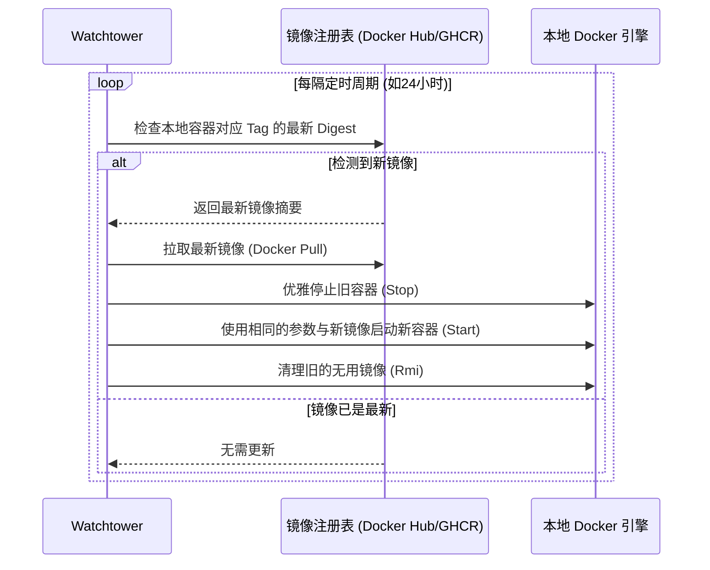

在搭建自己的 Homelab 或是运维小型服务器时，**Docker** 无疑是我们的绝对主力。从 Vaultwarden 密码管理器、Jellyfin 影音中心，到 AdGuard Home 过滤网关，我们几乎把所有的核心服务都塞进了容器里。

但随着时间推移，一个非常现实且令人头疼的维护难题摆在了面前：**如何保持这些容器版本的更新？**

许多人习惯了“装好就不管”，导致容器长期处于旧版本，暴露在已知的安全漏洞之下；也有人强迫症发作，每天手动登录终端，一遍又一遍地敲着 `docker-compose pull && docker-compose up -d`。

有没有一种方案，既能像手机应用商店一样**全自动检测并升级容器**，又不需要我们手动干预，同时还能把升级对服务中断的影响降到最低？

今天，我们就来部署一款 Docker 生态里的明星级运维神器 —— **Watchtower**，并分享如何通过精细化标签控制和实时日志推送，打造出企业级的自动化容器升级方案。

## Table of contents

## 一、为什么选择 Watchtower？

**Watchtower** 是一个用 Go 语言编写的轻量级开源应用。它的运行逻辑非常简单且优雅：

Watchtower 本身也作为一个 Docker 容器运行。你只需要将宿主机的 `/var/run/docker.sock`（Docker 守护进程的套接字）挂载给它，它就能获得监视和操作宿主机上其他容器的权限。



### Watchtower 的核心优势：
*   **无感升级**：升级时，它会完美保留容器原先的启动参数（如环境变量、端口映射、挂载卷、网络配置等），无需重新编写命令。
*   **垃圾自动清理**：在更新完成后，它会自动删除旧的、带有 `<none>` 标签的废弃镜像，防止宿主机磁盘被撑爆。
*   **极轻量级**：日常运行时几乎不占用 CPU，内存消耗仅十几 MB。

---

## 二、快速上手：Watchtower 极简部署

如果你想让 Watchtower 监视并更新服务器上的**所有**容器，使用以下 Docker Compose 配置文件即可一键部署。

首先，在我们推荐的常用配置目录中新建文件夹，然后创建 `docker-compose.yml` 文件：

```yaml
version: '3.8'

services:
  watchtower:
    image: containrrr/watchtower:latest
    container_name: watchtower
    restart: unless-stopped
    volumes:
      - /var/run/docker.sock:/var/run/docker.sock
    environment:
      - TZ=Asia/Shanghai
      - WATCHTOWER_CLEANUP=true
      - WATCHTOWER_REMOVE_VOLUMES=false
      - WATCHTOWER_SCHEDULE=0 0 4 * * * # 每天凌晨 4 点执行更新
```

### 💡 核心环境变量解析：
*   `WATCHTOWER_CLEANUP=true`：更新后自动删除旧镜像，释放磁盘空间。
*   `WATCHTOWER_REMOVE_VOLUMES=false`：非常关键！禁止在删除容器时清除其关联的匿名数据卷，确保数据安全。
*   `WATCHTOWER_SCHEDULE`：这里使用了标准的 Cron 表达式。`0 0 4 * * *` 表示**每天凌晨 4 点整**准时进行版本比对。避开白天的业务高峰期，即使重启造成短暂断网也几乎无感。
*   如果你还不熟悉 Docker Compose 的底层运行和目录规划，欢迎阅读我们之前的入门指南：[《Docker Compose 从零起步：常用命令与基础规范》](/posts/docker-compose-basics/)。

---

## 三、进阶：使用 Label 实现“精准打击”

“自动更新所有容器”虽然听起来很爽，但在实际生产环境中往往会**埋下深坑**。

例如，你的数据库容器（如 PostgreSQL / MySQL）、或者像 Vaultwarden 这样极其核心的密码管理服务，如果任由其在夜间悄悄升级到重大版本，一旦遇到破坏性改动（Breaking Changes）导致数据库结构不兼容，第二天醒来你将面对服务彻底瘫痪的惨剧。

因此，最合理的策略是：**默认不更新，只有我们手动标记了“允许自动更新”的容器才进行升级**。

### 1. 开启 Watchtower 的 Label 过滤模式
我们只需要在 Watchtower 的环境变量中，加入 `- WATCHTOWER_LABEL_ENABLE=true`：

```yaml
# 修改后的 Watchtower 配置
services:
  watchtower:
    image: containrrr/watchtower:latest
    container_name: watchtower
    restart: unless-stopped
    volumes:
      - /var/run/docker.sock:/var/run/docker.sock
    environment:
      - WATCHTOWER_LABEL_ENABLE=true # 启用标签过滤模式
      - WATCHTOWER_CLEANUP=true
      - WATCHTOWER_SCHEDULE=0 0 4 * * *
```

### 2. 在目标容器中打上“放行”标签
对于那些你不担心更新出问题的无状态服务（例如 AdGuard Home、Uptime Kuma 等），你只需要在它们的 `docker-compose.yml` 里的 `labels` 块中加入：
`com.centurylinklabs.watchtower.enable=true`。

以 Uptime Kuma 为例：

```yaml
services:
  uptime-kuma:
    image: louislam/uptime-kuma:1
    container_name: uptime-kuma
    ports:
      - 3001:3001
    volumes:
      - ./data:/app/data
    labels:
      - com.centurylinklabs.watchtower.enable=true # 明确授权 Watchtower 自动更新此容器
```

这样，Watchtower 在凌晨巡检时，就会自动跳过没有该标签的数据库，只对打了标签的容器执行拉取和重启。

---

## 四、安全感来源：联动推送升级日志

自动化运维最怕的是“死得悄无声息”。如果某个容器升级后起不来了，我们必须第一时间知晓。

Watchtower 内置了极其丰富的通知渠道，支持 Telegram、Discord、Slack、邮件以及 Gotify。

这里以极客最常用的 **Telegram Bot** 推送为例，配置方式非常简单。只需在 Watchtower 的 `environment` 中补充以下参数：

```yaml
    environment:
      - WATCHTOWER_LABEL_ENABLE=true
      - WATCHTOWER_CLEANUP=true
      - WATCHTOWER_SCHEDULE=0 0 4 * * *
      # Telegram 通知配置
      - WATCHTOWER_NOTIFICATIONS=telegram
      - WATCHTOWER_NOTIFICATION_TEMPLATE={{range .}}{{.Message}}{{println}}{{end}}
      - WATCHTOWER_NOTIFICATION_URL=telegram://<YOUR_BOT_TOKEN>@telegram/?channels=<YOUR_CHAT_ID>
```

> ⚙️ **如何获取 Token 和 ID？**
> 1. 向 Telegram 的 `@BotFather` 申请一个新机器人，获取 `YOUR_BOT_TOKEN`。
> 2. 向 `@userinfobot` 发送任意消息，获取你自己的用户或频道 `YOUR_CHAT_ID`。

配置好后，每天清晨你打开手机，就会收到类似下面的温馨提示：
> *Watchtower 2026-06-09 04:00:12: Updating louislam/uptime-kuma:1... container updated successfully.*

如果你还没有部署属于自己的节点监控，不知道如何监控整个服务器状态，建议参考：[《轻量级监控神仙组合：用 Uptime Kuma 实时把控你的 Homelab 网络》](/posts/uptime-kuma-node-monitoring/)。

---

## 五、降温与灾备防线

虽然有标签过滤和日志推送，但为了万无一失，在享受 Watchtower 带来的便捷时，我们还需筑牢两道防线：

1.  **挂载卷数据（Volume）必须本地持久化**：
    绝对不要使用匿名卷。所有容器的数据库、配置文件存储路径，都应当通过 `- ./data:/app/data` 挂载到主机的物理目录下。这样即使容器被 Watchtower 销毁重建，你的数据依然完好无损。
2.  **关键服务配合定时备份**：
    对于核心账密服务，如自建的 Vaultwarden，强烈建议配合 Rclone 等工具每天定时加密备份数据库。可以参考本站的备份教程：[《Docker 极简 Vaultwarden 部署与数据防丢备份指南》](/posts/vaultwarden-docker-self-hosted/)。

## 结语

Watchtower 用最优雅的“旁路监视”模式，解决了 Docker 生态中版本滞后的痛点。通过合理配置 **Label 过滤模式** 和 **Cron 凌晨定时更新**，我们既能让那些无状态、高更频的辅助网关保持最新状态，又不会威胁到核心数据库的稳定性。

快把 Watchtower 塞进你的 Docker 编排文件里，彻底把双手从繁琐的命令行升级中解放出来吧！
