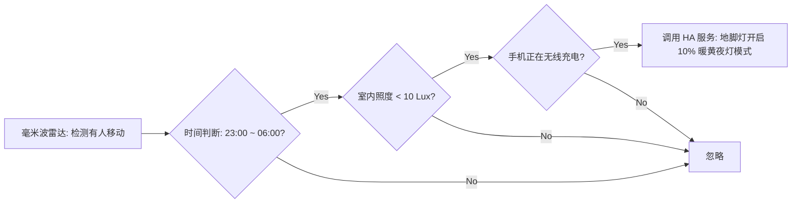

很多追求科技感的朋友在刚接触物联网（IoT）时，都不可避免地跌入“生态孤岛”的痛点：
买了小米台灯、飞利浦彩光灯带、绿米人体传感器，再加一个涂鸦智能窗帘；睡觉时要开好几个 App 或对着不同品牌的音箱分别喊话。不同厂商之间筑起生态高墙，官方 App 绝不允许竞品设备互相条件联动。

在 2026 年，利用闲置软路由、NAS 或 PVE 虚拟机，部署 **Home Assistant (HA)** 与 **Node-RED**，是打破生态壁垒、打造全屋无感联动的终极解药！

> [!NOTE]
> **📌 核心速览（TL;DR / 快问快答）：**
>
> - **Home Assistant (总指挥)**：万能设备聚合器，通过 Zigbee2MQTT、Matter、ESPHome 与 HACS 插件，将米家、苹果 HomeKit、涂鸦、飞利浦等数万种设备统一映射为通用 Entity 实体。
> - **网络配置避坑**：HA 容器必须采用 `network_mode: host`，否则 mDNS 组播发现机制失效，局域网 HomeKit、Sonos、飞利浦 Hue 将无法被自动搜寻。
> - **Node-RED (逻辑大脑)**：基于流（Flow-based）的可视化编程工具，告别庞大冗长的 YAML 嵌套，拖拽连线即可实现毫米波雷达、光照度、时间区间与多传感器条件融合决策。

---

## 🛠️ 2026 生产级 Docker Compose 一体化部署

在服务器创建 `compose.yaml`：

```yaml
services:
  homeassistant:
    image: ghcr.io/home-assistant/home-assistant:stable
    container_name: homeassistant
    restart: unless-stopped
    privileged: true
    network_mode: host # 必须使用 host 模式保障局域网组播设备发现
    volumes:
      - ./ha-config:/config
      - /etc/localtime:/etc/localtime:ro
      - /run/dbus:/run/dbus:ro # 支持蓝牙设备代理探测

  nodered:
    image: nodered/node-red:latest
    container_name: nodered
    restart: unless-stopped
    ports:
      - "1880:1880"
    environment:
      - TZ=Asia/Shanghai
    volumes:
      - ./nodered-data:/data
```

启动服务：`docker compose up -d`。

---

## 🚀 Node-RED 与 HA 联动实战：毫米波人体感应起夜灯流

在 Node-RED 安装 `node-red-contrib-home-assistant-websocket` 插件，拖拽即可组合出极为优雅的联动流：



### 为什么选择 Node-RED 而不是原生 YAML？

- **多条件分支极其清晰**：在 Node-RED 侧边栏可以实时挂载 `Debug` 节点，当自动化未按预期触发时，直接拦截查看输入参数，秒级定位是传感器掉线还是照度判断未达标。

---

## ❓ 常见问题与 AI 快问快答 (FAQ)

### Q1: 如何将全部非苹果智能设备接入 Apple 家庭 (HomeKit)？

**答**：在 Home Assistant 中直接启用 **Apple HomeKit 集成**；HA 会自动生成配对二维码，用 iPhone“家庭”App 扫描，全屋小米、绿米、涂鸦设备瞬间映射至 iPhone 控制中心与 Siri 语音控制！

### Q2: 自建 HA 智能家居远程控制推荐哪家海外 VPS 搭建安全穿透？

**答**：在 **DMIT** 或 **搬瓦工** 的 **中国电信 CN2 GIA** 专线 VPS 上配置 Cloudflare Tunnel 或 WireGuard 回家隧道，在户外用 5G 手机控制家中智能灯与空调响应延迟低于 50ms。选购参考见 [《2026 国外 VPS 选购指南》](/posts/vps-buying-guide-2026/)。

---

_（相关资源导航：如果您需要购买部署云端中继网关的独立 VPS，欢迎阅读 [《2026 国外 VPS 选购指南》](/posts/vps-buying-guide-2026/) 获取 DMIT、搬瓦工与 CloudCone 优惠；商用专线推荐见 [《“饿饭CC云”深度评测》](/posts/efan-cc-cloud-review/)！）_
