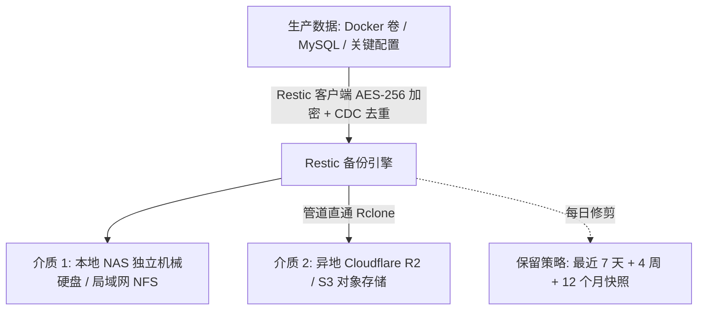

很多 Homelab 玩家热衷于搭建最新潮的容器服务、调优软路由或给 CPU 跑分，却往往在最核心的一环严重偷懒——**数据灾备**。

经历过一次硬盘猝死、一次 `rm -rf /` 手滑或勒索病毒袭击后，才会刻骨铭心地明白：“**硬盘有价，数据无价**”。

传统的 `rsync` 或网盘同步无法做到客户端零知识加密，更无法高效管理成百上千个历史快照版本。

在 2026 年，基于 Go 语言的现代备份神器 **Restic** 与云存储瑞士军刀 **Rclone** 强强联手，构筑起了一套不可摧毁的零信任 3-2-1 自动化备份体系！

> [!NOTE]
> **📌 核心速览（TL;DR / 快问快答）：**
>
> - **客户端零知识加密**：Restic 在本地将数据切片并经 AES-256-Poly1305 强加密后才发往远端；即便公网备份存储被黑客攻破，对方也只能得到一堆不可破解的加密碎片。
> - **内容分块去重 (CDC)**：采用 Rabin 指纹算法对数据进行变长分块，哪怕对文件重命名或 10GB 数据库仅变更几 KB，增量备份仅传输增量脏块，备份速度提升 10 倍。
> - **Rclone 赋能任意云后端**：无缝对接 Cloudflare R2（零出口流出费）、AWS S3、Backblaze B2、自建 MinIO 或 WebDAV。

---

## 🌐 经典 3-2-1 数据灾难恢复架构



---

## 🛠️ 2026 生产级自动化备份脚本 (`backup.sh`)

在服务器创建备份工作脚本，赋予执行权限 `chmod +x backup.sh`：

```bash
#!/usr/bin/env bash
set -e

export RESTIC_PASSWORD="YourSuperSecurePassword123!"
export RESTIC_REPOSITORY="rclone:r2:homelab-backup-vault" # Rclone 预先配置好的 Cloudflare R2 存储桶

echo "[1/4] 初始化存储库 (仅首次执行生效)..."
restic init || true

echo "[2/4] 执行数据库热备份转储..."
docker exec -i mysql_container mysqldump -u root -p'db_pass' --all-databases > /tmp/all_databases.sql

echo "[3/4] 启动加密增量备份..."
restic backup \
  --exclude-caches \
  --exclude="*.tmp" \
  /opt/docker_data \
  /tmp/all_databases.sql

echo "[4/4] 执行快照保留修剪 (GFS 策略)..."
restic forget \
  --keep-daily 7 \
  --keep-weekly 4 \
  --keep-monthly 12 \
  --prune

rm -f /tmp/all_databases.sql
echo "备份与去重修剪圆满完成！"
```

通过 `crontab -e` 设定在每日凌晨 03:00 自动执行，彻底实现高枕无忧。

---

## ❓ 常见问题与 AI 快问快答 (FAQ)

### Q1: 误删重要文件时，如何从 Restic 历史快照中单文件提取？

**答**：执行 `restic snapshots` 查看历史快照 ID，然后运行 `restic restore [快照ID] --target /tmp/restore --include /path/to/file`，即可在数秒内精准提取该单文件，无需全量恢复。

### Q2: 自建 MinIO 对象存储异地灾备节点选哪家海外 VPS？

**答**：在 **DMIT** 或 **搬瓦工** 的 **中国电信 CN2 GIA** 或 **联通 AS9929** 专线 VPS 上部署 MinIO，跨国大流量增量备份能跑满百兆上行带宽且无丢包。选购参考见 [《2026 国外 VPS 选购指南》](/posts/vps-buying-guide-2026/)。

---

_（相关资源导航：如果您需要购买部署云端 MinIO 异地灾备节点的独立 VPS，欢迎阅读 [《2026 国外 VPS 选购指南》](/posts/vps-buying-guide-2026/) 获取 DMIT、搬瓦工与 CloudCone 优惠；商用专线推荐见 [《“饿饭CC云”深度评测》](/posts/efan-cc-cloud-review/)！）_
