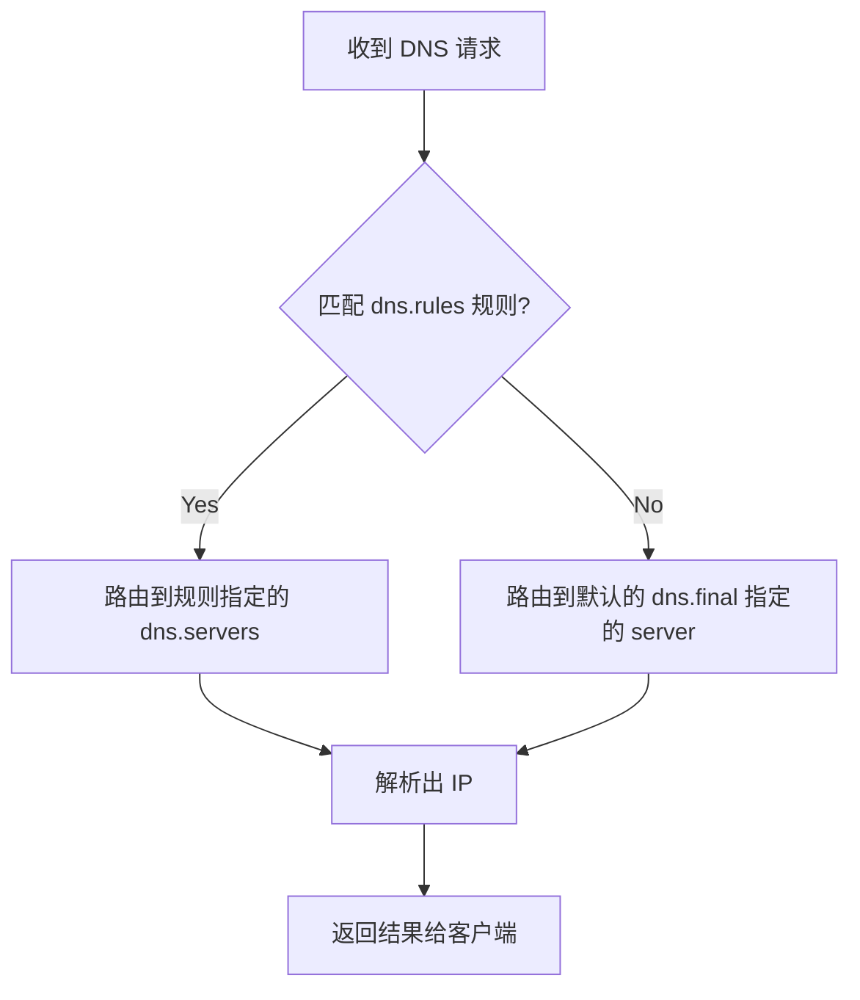

在网络分流和代理工具的日常使用中，绝大多数诡异的问题——比如“国内网站加载缓慢”、“部分国外服务时好时坏”、或者“明明连上了节点却依然打不开网页”——其背后的罪魁祸首往往只有一个：**DNS 配置不当**。

DNS 既是网络连接的“探路先锋”，也是最容易发生隐私泄露和流量污染的脆弱地带。在使用 Clash 时代，许多人习惯了依赖客户端内置的魔法默认配置；而到了以“极致可控”和“高内聚”著称的 **Sing-box** 时代，DNS 被设计成了一个极其严谨且独立的模块。

如果你想彻底降伏 Sing-box，就必须理解它的 DNS 运行机理。今天我们就来抽丝剥茧，一次性把 Sing-box 的 DNS 分流、FakeIP 机制以及防污染配置讲个透彻。

## Table of contents

## 一、为什么传统 DNS 解析在分流环境下会“翻车”？

在常规网络下，我们的电脑向本地运营商的 DNS（如 `114.114.114.114`）发起查询，运营商返回 IP，电脑直连，一切很完美。

但在**代理/分流网络**环境下，这种纯朴的设计会遭遇致命的双重打击：

### 1. DNS 污染（DNS Poisoning / Spoofing）
当你试图访问类似 `google.com` 的网站时，如果你向国内的 DNS 发起请求，国内的网关会先于真实的海外服务器返回一个**错误的、不存在的垃圾 IP**。你的浏览器拿到了这个假 IP，就再也无法建立连接。这就是著名的“DNS 污染”。

### 2. DNS 泄露（DNS Leak）
为了绕过污染，你可能会把全局 DNS 设为海外的加密 DNS（如 `8.8.8.8` 的 DoH）。污染是解决了，但当你访问国内淘宝、腾讯视频等网站时，你的所有国内域名查询都会跨越太平洋发送到 Google 的服务器。
这不仅导致**解析延迟暴增**（至少增加上百毫秒的延迟），而且还会让国内内容分发网络（CDN）误以为你身处海外，从而给你分配一个海外的服务器节点，导致**国内直连访问速度雪崩**。

> 💡 **终极目标**：国内域名直接由国内快速 DNS 解析，且绝对不发往国外；国外域名全部通过加密通道由国外可信 DNS 解析，且绝对不向国内泄露查询记录。

---

## 二、Sing-box 的 DNS 核心管道流转机制

Sing-box 彻底抛弃了模糊不清的自动配置，要求用户以极其精确的“逻辑流水线”来控制 DNS。在 Sing-box 的 `dns` 配置块中，有三个最核心的要素：

```json
"dns": {
  "servers": [...],
  "rules": [...],
  "final": "..."
}
```

这三个词在 Sing-box 内部构成了一个完整的**路由管道**：



*   **`servers`（解析源）**：这是一组你信任的 DNS 服务器列表，每一个 server 都要起一个唯一的 `tag`。比如国内用阿里 DoH，国外用 Cloudflare DoH。
*   **`rules`（分流规则）**：这是一套匹配逻辑。当系统收到一个域名的查询请求时，它会从上到下依次匹配这些规则。一旦匹配成功，就把请求发给该规则绑定的特定 `server`。
*   **`final`（兜底源）**：当所有的 `rules` 都没有匹配成功时，域名查询会走向这个兜底的服务器。**为了防止漏网之鱼发生污染，通常建议将 `final` 设为海外可信的加密 DNS（如 `cloudflare-max`）。**

---

## 三、FakeIP 还是 RealIP？选择你的分流哲学

在配置 Sing-box 的入站（inbound）和 DNS 时，你会面临两个流派的选择：**FakeIP（虚假 IP）** 和 **RealIP（真实 IP）**。

### 1. RealIP 模式（直连优先）
在 RealIP 模式下，当浏览器请求 `google.com` 时，Sing-box 必须**先真实地通过国外可信 DNS 拿到真实的海外 IP**，然后拿着这个 IP 在出站路由（route.rules）里进行比对。如果这个 IP 属于国外，就走代理出站。
*   **优点**：系统路由表里全都是真实的 IP，排查问题直观，局域网内其他设备共享时不会有奇怪的兼容问题。
*   **缺点**：因为路由比对依赖 IP，所以在代理连接建立前，必须先等待一次高延迟的远程 DNS 查询，这被称为“**解析阻断延迟**”。

### 2. FakeIP 模式（秒连优先）
为了解决解析延迟，Clash 和 Sing-box 引入了 **FakeIP**。
当浏览器请求 `google.com` 时，Sing-box 不去发起真实的 DNS 查询，而是立刻从一个特殊的内网网段（例如 `198.18.0.0/16`）里随手抓一个**假的临时 IP**（例如 `198.18.0.5`）返回给浏览器，浏览器以为解析成功了，立刻向该假 IP 发送数据包。
当数据包流入 Sing-box 的内核后，Sing-box 再根据数据包的对应关系还原出它原本要访问的是 `google.com`，然后在远端服务器上进行域名解析与连接。
*   **优点**：**极速建立连接**。浏览器不需要等待 DNS 解析完成，网络交互流畅度大幅度提升。
*   **缺点**：如果排查日志，你会看到满屏幕的 `198.18.x.x`，很难直观看出流量到底流向了哪里；且某些不支持非真实 IP 的老旧游戏和软件可能会报错。

> 📝 **毛佳国的避坑建议**：
> *   如果你是部署在**单兵电脑、手机端**，推荐使用 **FakeIP**，体验最丝滑。
> *   如果你是部署在**旁路网关、全家软路由**上，为了兼容智能家居等复杂设备，推荐使用以国内解析为主的 **RealIP 智能分流**。

---

## 四、实战：Sing-box 完美防污染 RealIP 配置模板

下面我为大家提供一套经过线上实战检验的 **RealIP 智能分流配置**。它将 DNS 模块与路由模块无缝绑定，实现了：**国内直连瞬间解析，国外域名加密防污染，拒绝任何 DNS 泄露**。

```json
{
  "dns": {
    "servers": [
      {
        "tag": "dns_direct",
        "address": "https://223.5.5.5/dns-query",
        "detour": "direct"
      },
      {
        "tag": "dns_proxy",
        "address": "https://8.8.8.8/dns-query",
        "detour": "proxy_nodes"
      },
      {
        "tag": "dns_block",
        "address": "rcode://success"
      }
    ],
    "rules": [
      {
        "outbound": "any",
        "server": "dns_direct"
      },
      {
        "query_type": [
          "AAAA"
        ],
        "server": "dns_block"
      },
      {
        "rule_set": "geosite-category-ads-all",
        "server": "dns_block"
      },
      {
        "rule_set": "geosite-geolocation-cn",
        "server": "dns_direct"
      },
      {
        "rule_set": "geosite-geolocation-!cn",
        "server": "dns_proxy"
      }
    ],
    "final": "dns_proxy",
    "strategy": "ipv4_only"
  },
  "route": {
    "rules": [
      {
        "protocol": "dns",
        "action": "hijack-dns"
      },
      {
        "rule_set": "geoip-cn",
        "outbound": "direct"
      },
      {
        "rule_set": "geosite-geolocation-cn",
        "outbound": "direct"
      }
    ]
  }
}
```

### 💡 核心亮点原理解析

1.  **`detour`（分流绕行）**：
    *   在 `dns_proxy` 中，我们设定了 `"detour": "proxy_nodes"`。这意味着向 `8.8.8.8` 发起 DNS 查询的数据包，**必须强行塞进你的代理节点通道中**发送。这从根本上杜绝了在本地直连公网时向海外 DNS 发送明文包，防止了运营商层面的干扰与中间人监视。
2.  **屏蔽 IPv6 DNS (AAAA) 以防漏网**：
    *   在配置中我们用一条规则将 `query_type: ["AAAA"]` 路由到 `dns_block`（返回空记录）。除非你的网络纯 IPv6 环境，否则在目前双栈环境下，屏蔽 AAAA 解析能极大减少因 IPv6 绕过代理造成的奇怪断流与延迟。
3.  **DNS 劫持 (`hijack-dns`)**：
    *   在路由规则 `route.rules` 第一条，我们配置了 `"protocol": "dns", "action": "hijack-dns"`。这会强制捕获系统中所有局域网设备或者本地软件发往外部 `53` 端口的传统明文 DNS 请求，将其温柔地“绑架”进 Sing-box 的高安全 DNS 管道中，实现全局防污染。

---

## 五、如何验证你的配置是否完美？

配置完成后，我们不能光凭感觉，必须进行实地科学测试。

### 1. 验证 DNS 泄露
打开浏览器，访问权威测试网站：[DNS Leak Test](https://dnsleaktest.com/)。
*   点击 **Standard test** 或 **Extended test**。
*   **完美的结果表现**：列表中呈现的 DNS 服务器**应当只包含你代理节点所在的托管商机房 IP**，绝对不应该出现你本地宽带运营商（如中国电信、联通、移动）的任何 IP 记录。一旦出现国内 IP，说明存在 DNS 泄露！

### 2. 命令行诊断（以 macOS/Linux 为例）
在终端中，强制通过本地被劫持的 DNS 进行解析：
```bash
dig @127.0.0.1 google.com
```
观察返回结果中的 `SERVER` 字段以及解析时间。如果解析耗时在几毫秒以内，并且返回的 IP 地址是正确的全球分发 IP（非国内局域网保留或错误 IP），则说明拦截与解析大获成功！

---

## 结语

Sing-box 就像一把绝世宝剑，它的 DNS 机制虽然在初见时显得有些硬核和难以亲近，但一旦你用逻辑理清了 `servers` 与 `rules` 的上下游管道关系，它就能为你提供前所未有的超高控制力与极致的低延迟体验。

如果你在配置 DNS 时遇到了其他的奇特报错，或者想了解如何配合 SmartDNS 等本地上游做更复杂的局域网分流，欢迎在我的这篇关联文章中继续深入阅读：[Sing-box 终极配置实战指南](/posts/sing-box-full-configuration-combat-2026/) 以及 [如何优雅检测并防御 DNS 泄露与 FakeIP 溢出](/posts/sing-box-dns-leak-fakeip/)。
